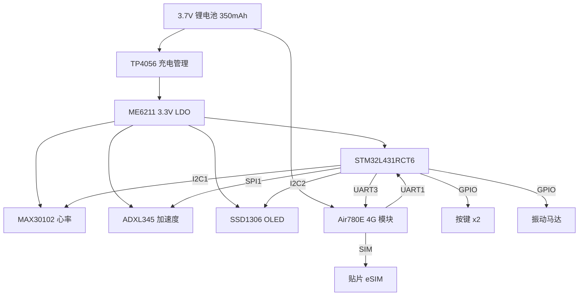

# SmartBand 智能手环 — 嘉立创 PCB 设计手册

> 主控: STM32L431RCT6 | 4G: Air780E | 开发工具: 嘉立创 EDA (标准版)

---

## 一、系统框图



## 二、引脚连接总表

### 2.1 STM32L431RCT6 → 外设

| STM32 引脚 | 功能 | 外设引脚 | 备注 |
|---|---|---|---|
| **I2C1** | | | |
| PB6 | SCL | MAX30102 SCL | 4.7kΩ 上拉到 3.3V |
| PB7 | SDA | MAX30102 SDA | 4.7kΩ 上拉到 3.3V |
| PB1 | GPIO INT | MAX30102 INT | |
| **I2C2** | | | |
| PB10 | SCL | SSD1306 SCL | 4.7kΩ 上拉到 3.3V |
| PB11 | SDA | SSD1306 SDA | 4.7kΩ 上拉到 3.3V |
| **SPI1** | | | |
| PA5 | SCK | ADXL345 SCL | |
| PA6 | MISO | ADXL345 SDO | |
| PA7 | MOSI | ADXL345 SDA | |
| PA4 | CS | ADXL345 CS | |
| PA8 | GPIO INT | ADXL345 INT1 | |
| **UART1 (调试)** | | | |
| PA9 | TX | USB-TTL RX | |
| PA10 | RX | USB-TTL TX | |
| **UART3 (4G)** | | | |
| PC10 | TX | Air780E UART1_RX | **1.8V/3.3V 电平匹配** |
| PC11 | RX | Air780E UART1_TX | **需电平转换** |
| **GPIO 控制** | | | |
| PC13 | PWRKEY | Air780E PWRKEY | 开漏输出, 默认高 |
| PC14 | RESET | Air780E RESET | 默认高 |
| PC15 | NET_STATUS | Air780E NET_STATUS | 输入, 检测注网 |
| PA0 | BTN_MODE | 按键 | 10kΩ 上拉到 3.3V |
| PA1 | BTN_SELECT | 按键 | 10kΩ 上拉到 3.3V |
| PA2 | VIBRATOR | 振动马达 | NMOS 驱动 (AO3400) |

### 2.2 Air780E → 外设

| Air780E 引脚 | 连接 | 备注 |
|---|---|---|
| VBAT | 锂电池正极 (3.7V) | 直接供电, 模块耐压 3.1~4.5V |
| GND | 电源地 | **大面积铺地** |
| UART1_TX | PC11 (STM32 UART3 RX) | 经过电平转换 |
| UART1_RX | PC10 (STM32 UART3 TX) | 经过电平转换 |
| PWRKEY | PC13 | 1.5s 低电平开机 |
| RESET | PC14 | 50ms 低电平复位 |
| NET_STATUS | PC15 | 注网指示 |
| USIM_VDD | eSIM VCC | |
| USIM_DATA | eSIM IO | 22Ω 串联 |
| USIM_CLK | eSIM CLK | 22Ω 串联 |
| USIM_RST | eSIM RST | 22Ω 串联 |
| RF_ANT | 4G 天线 | **50Ω 阻抗匹配** |
| USB_BOOT | 悬空 | 正常模式 |

## 三、关键电路设计

### 3.1 ⚠️ 电平转换（Air780E UART）

```
Air780E 的 UART1 逻辑电平是 1.8V！
STM32 的 GPIO 是 3.3V。

必须加电平转换电路，否则烧毁 Air780E！

方案 A（推荐）：2 路 MOSFET 电平转换（BSS138 ×2）
  3.3V ──┬── 10kΩ ──┬── 1.8V
         │           │
  STM32  ─┴─ Drain   Source ─┴─ Air780E
              Gate ── 3.3V
              
方案 B（懒人）：4 通道电平转换模块 TXS0104E

方案 C（省钱不推荐）：电阻分压（仅限 3.3→1.8 方向勉强可用）
```

### 3.2 4G 天线设计

```
┌─────────────────────────────────────────────┐
│  嘉立创 PCB 板载天线方案（免费）              │
│                                              │
│  ┌── 50Ω 微带线 ──┐                          │
│  │  宽度 ≈ 1.8mm  │  ← 1.6mm 厚 FR-4 板材    │
│  │  长度 < 30mm    │                          │
│  └──── π 匹配 ────┘                          │
│                                              │
│  Air780E 模块内部已含天线匹配电路，           │
│  只需将 RF_ANT 引脚通过 50Ω 微带线            │
│  连接到 IPEX 座子或 PCB 印制倒F天线。         │
│                                              │
│  ⚠ 天线区域下方禁止铺铜！                     │
│  ⚠ 远离电池、金属外壳                        │
└─────────────────────────────────────────────┘
```

### 3.3 SIM 卡电路

```
Air780E 推荐使用贴片 eSIM (CMLink / 优友物联)

USIM_VDD ───────────── eSIM VCC
USIM_RST ── 22Ω ──── eSIM RST
USIM_CLK ── 22Ω ──── eSIM CLK
USIM_DATA ─ 22Ω ──── eSIM IO  ── 33pF ── GND
                         │
                         └── 15kΩ ── USIM_VDD (上拉)
```

### 3.4 电源设计

```
锂电池 3.7V ──┬── TP4056 ── USB 5V 充电
              │
              ├── Air780E VBAT (直接供电, 不经过 LDO)
              │   
              ├── ME6211C33M5G ── 3.3V ── STM32 + 传感器 + OLED
              │
              └── 10μF + 100nF 去耦电容 (靠近 Air780E VBAT)
```

### 3.5 振动马达驱动

```
STM32 PA2 ── 1kΩ ──┬── AO3400 NMOS Gate
                    │
                    ├── 100kΩ ── GND (Gate 下拉)
                    │
                    Drain ── 振动马达 ── VBAT (3.7V)
                    Source ── GND
                    │
                    └── 肖特基二极管 (续流保护)
```

## 四、嘉立创 EDA 操作步骤

1. 打开 [嘉立创 EDA 标准版](https://lceda.cn/editor)
2. **新建工程** → 命名 `SmartBand`
3. **原理图页**：
   - 放置 `STM32L431RCT6`（从嘉立创元件库搜索）
   - 放置 `Air780E`（搜索 "Air780E" 或 "合宙"）
   - 放置各传感器模块
   - 按本手册的连接表连线
4. **PCB 布局**：
   - 板厚 1.6mm，FR-4，2 层
   - 推荐尺寸: **40mm × 28mm**（手环形态）
   - 天线区域放在板边，下方挖空铺铜
5. **打板**：嘉立创 5 元/5 片包邮

## 五、BOM 物料清单

| 序号 | 物料 | 规格/型号 | 位号 | 数量 | 单价(¥) |
|---|---|---|---|---|---|
| 1 | MCU | STM32L431RCT6 LQFP-64 | U1 | 1 | 18.0 |
| 2 | 4G 模块 | 合宙 Air780E LGA | U2 | 1 | 16.0 |
| 3 | eSIM | CMLink 贴片 QFN-8 | U3 | 1 | 2.0 |
| 4 | 心率 | MAX30102 模块 | U4 | 1 | 12.0 |
| 5 | 加速度 | ADXL345 模块 | U5 | 1 | 6.0 |
| 6 | OLED | SSD1306 128×64 I2C | U6 | 1 | 8.0 |
| 7 | 充电 IC | TP4056 SOT-23-5 | U7 | 1 | 0.5 |
| 8 | 3.3V LDO | ME6211C33M5G SOT-23-5 | U8 | 1 | 0.3 |
| 9 | 电平转换 | BSS138 SOT-23 ×2 | Q1,Q2 | 2 | 0.3 |
| 10 | NMOS | AO3400 SOT-23 | Q3 | 1 | 0.2 |
| 11 | 振动马达 | 1027 扁平 3V | M1 | 1 | 2.0 |
| 12 | 电池 | 3.7V 350mAh 锂聚 402030 | BT1 | 1 | 10.0 |
| 13 | 4G 天线 | 板载 PCB 倒F | — | 0 | 0 |
| 14 | 按键 | 3×4×2.5mm 贴片 | SW1,SW2 | 2 | 0.3 |
| 15 | USB | Type-C 6P 贴片 | J1 | 1 | 1.5 |
| 16 | 晶振 | 12MHz 3225 | Y1 | 1 | 0.5 |
| 17 | 电阻/电容 | 0603 各阻值 | — | 20 | 1.0 |
| | | | | **合计** | **≈79** |
